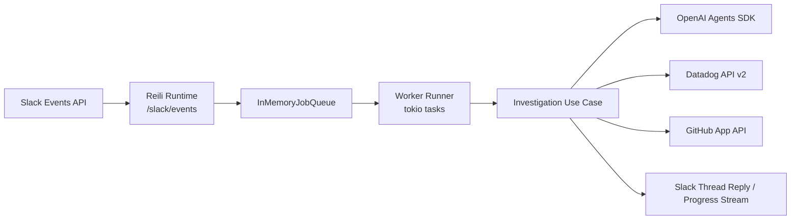

<div align="center">
  <h1>Reili</h1>
  <p><strong>A Slack-native AI agent for read-only DevOps investigations</strong></p>
  <p>
    Investigate alerts quickly across Datadog, GitHub, and Slack threads.
    <br />
    Operate with a simple database-free architecture.
  </p>
</div>

## Why Reili

`Reili` starts from Slack messages and investigation requests, then:

- Investigates Datadog Logs, Metrics, and Events
- Explores GitHub repositories, PRs, and code

It focuses on read-oriented DevOps work: triage, investigation, and synthesis.

## Core Features

- Slack-native intake via `message` and `app_mention` events
- Single-process runtime:
  - One HTTP server receives Slack events at `/slack/events`
  - In-process worker tasks claim jobs from `InMemoryJobQueue`
- Multi-agent investigation:
  - Specialized sub-agents for Logs, Metrics, Events, and GitHub
  - A Coordinator orchestrates the flow, then a Synthesizer writes the final report
- Database-free operations:
  - In-memory job queue (`InMemoryJobQueue`)
  - No extra DB infrastructure required

## Architecture



### Runtime Characteristics

- Database-free: no persistent state component
- Job queue is in-memory, so pending jobs are lost on app restart
- Datadog API calls use retry configuration (max 3 retries)

## Quick Start

### 1. Prerequisites

- Rust stable toolchain
- Slack App (Bot Token / Signing Secret)
- Datadog API Key + APP Key
- OpenAI API Key
- GitHub App (App ID / Private Key / Installation ID)

### 2. Install

```bash
cp .env.example .env
```

### 3. Configure Environment Variables

Required:
- `SLACK_BOT_TOKEN`
- `SLACK_SIGNING_SECRET`
- `DATADOG_API_KEY`
- `DATADOG_APP_KEY`
- `OPENAI_API_KEY`
- `GITHUB_APP_ID`
- `GITHUB_APP_PRIVATE_KEY`
- `GITHUB_APP_INSTALLATION_ID`
- `GITHUB_SEARCH_SCOPE_ORG`

Common optional variables:

- `PORT` (default: `3000`)
- `DATADOG_SITE` (default: `datadoghq.com`)
- `LANGUAGE` (default: `English`)

### 4. Configure Slack App

- Set Event Subscriptions Request URL to `https://<your-host>/slack/events`
- Subscribe to at least `app_mention` and relevant `message.*` bot events
- Grant Bot OAuth scopes needed for thread replies and thread history reads

### 5. Run

Single-process runtime:

```bash
cd rust
bash -lc 'set -a; source ../.env; set +a; cargo run -p reili_runtime'
```

If you use `cargo-watch`:

```bash
cd rust
bash -lc 'set -a; source ../.env; set +a; cargo watch -x "run -p reili_runtime"'
```

## Usage

Mention the bot in Slack with an investigation request:

```text
@Reili Please investigate this alert. Check error increase in the last 30 minutes and correlate with recent PRs.
```

What happens:

1. It posts investigation progress in the thread
2. It investigates across Datadog and GitHub
3. It replies with an evidence-backed summary

## Development

For local development setup, architecture rules, and contributor workflows, see [DEVELOPERS.md](./DEVELOPERS.md).

## Non-Goals

- Executing operational actions like auto-remediation or auto-deploy
- Heavy stateful workflow orchestration

This project is intentionally focused on investigation and decision support.
