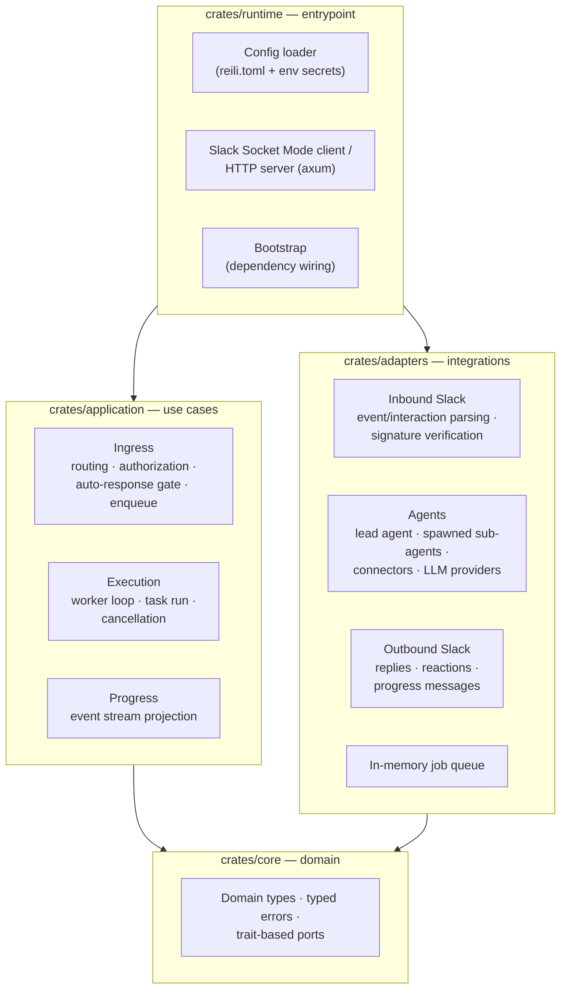

# Architecture

Reili ships as a single Rust binary organized as a four-crate workspace with a
ports-and-adapters (hexagonal) design. `core` defines domain types and trait-based ports,
`application` implements the use cases against those ports, `adapters` provides the concrete
integrations, and `runtime` loads config and wires everything together at startup.
Dependencies point strictly inward: `runtime -> application/adapters -> core`, and
`application` never imports `adapters` directly.

## Crate responsibilities

- `crates/core`: domain types, typed errors, and trait-based ports. Independent from runtime
  and adapter concerns.
- `crates/application`: use cases and task orchestration — Slack ingress (routing,
  authorization, auto-response gating, enqueue), task execution (worker loop, cancellation),
  and progress projection.
- `crates/adapters`: inbound Slack parsing and signature verification, outbound Slack Web API
  adapters, the agent stack (lead agent, dynamically spawned sub-agents, connectors, LLM
  providers), and the in-memory job queue.
- `crates/runtime`: config loading (`reili.toml` plus env secrets), dependency wiring in
  `bootstrap`, and the two Slack transports (Socket Mode client and axum HTTP server).

## Key design points

- **Trait-based ports**: external dependencies (Slack, queue, task runner, web search) are
  `Arc<dyn Trait>` ports defined in `core` and injected in `runtime/bootstrap`, so application
  logic is testable without external services.
- **Two Slack transports**: the same handlers serve Socket Mode (WebSocket) and HTTP mode
  (`/slack/events`, `/slack/interactions` with signature verification).
- **Multi-provider LLM backends**: OpenAI, Anthropic, Amazon Bedrock, and Vertex AI are
  pluggable providers behind one task-runner port; the lead and sub-agents can run on
  different models of the same provider.
- **Connector model**: Datadog, GitHub, JIRA (via MCP servers), and esa each contribute an
  allowlisted, read-only tool group to the catalog that the lead agent draws from when
  spawning sub-agents.
- **Cancellation**: the Slack `Cancel` button flows through the interaction handler to an
  in-flight job registry that cancels queued or running tasks.

For the runtime investigation flow, see the [Architecture section in README.md](../README.md#architecture).
For contributor workflows and architecture rules, see [DEVELOPERS.md](../DEVELOPERS.md).
